<!-- Replace links with your own or remove unused badges -->

  
  
  

<picture>
  <source media="(prefers-color-scheme: dark)" srcset="https://raw.githubusercontent.com/Samir-Salihov/Samir-Salihov/invaders/commit-invaders-dark.svg" />
  <source media="(prefers-color-scheme: light)" srcset="https://raw.githubusercontent.com/Samir-Salihov/Samir-Salihov/invaders/commit-invaders.svg" />
  
</picture>

<picture>
  <source media="(prefers-color-scheme: dark)" srcset="https://raw.githubusercontent.com/Samir-Salihov/Samir-Salihov/output/snake-dark.svg" />
  <source media="(prefers-color-scheme: light)" srcset="https://raw.githubusercontent.com/Samir-Salihov/Samir-Salihov/output/snake.svg" />
  
</picture>

